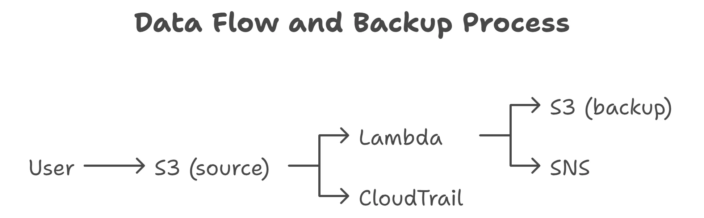

# AWS S3 File Backup System

[](https://aws.amazon.com)
[](https://www.python.org/)
[](https://www.serverless.com/)

A serverless file backup solution that automatically copies files from a source S3 bucket to a backup bucket with email notifications via Amazon SNS.

## 🌟 Features

- **Automated Backup**: Files uploaded to the source bucket are automatically backed up
- **Email Notifications**: Receive instant notifications for backup completions
- **Versioning Support**: Track and restore previous versions of files
- **Secure**: IAM-based access control and encryption
- **Audit Ready**: CloudTrail integration for activity monitoring
- **Cost-Effective**: Pay only for the resources you use

## 🏗️ Architecture



The solution uses the following AWS services:
- **Amazon S3**: Source and backup storage
- **AWS Lambda**: Processes file uploads and manages backups
- **Amazon SNS**: Sends email notifications
- **AWS IAM**: Manages permissions and security
- **AWS CloudTrail**: Logs API activity for auditing

## 🚀 Getting Started

### Prerequisites

- AWS Account with appropriate permissions
- AWS CLI configured with credentials
- Python 3.11
- AWS SAM CLI (for local testing)

### Installation

1. Clone the repository:
   ```bash
   git clone https://github.com/linktechlabs/aws-s3-file-backup.git
   cd aws-s3-file-backup
   ```

2. Install dependencies:
   ```bash
   pip install -r requirements.txt
   ```

### Deployment

1. Create the following AWS resources:
   - Source S3 bucket (e.g., `my-backup-source-s9dfu9`)
   - Backup S3 bucket (e.g., `my-backup-destination-834h9a`)
   - SNS Topic for notifications

2. Configure IAM roles with appropriate permissions:
   - Lambda execution role with S3 read/write and SNS publish permissions
   - S3 bucket policies to allow Lambda access

3. Deploy the Lambda function:
   - Set environment variables:
     - `BACKUP_BUCKET`: Your backup bucket name
     - `SNS_TOPIC_ARN`: Your SNS topic ARN

## 🔧 Configuration

### Environment Variables

| Variable | Description | Required | Example |
|----------|-------------|----------|---------|
| `BACKUP_BUCKET` | Name of the backup S3 bucket | Yes | `my-backup-destination-834h9a` |
| `SNS_TOPIC_ARN` | ARN of the SNS topic for notifications | Yes | `arn:aws:sns:region:account-id:FileBackupNotifications` |

### IAM Permissions

The Lambda function requires the following permissions:
- `s3:GetObject` on the source bucket
- `s3:PutObject` on the backup bucket
- `sns:Publish` on the SNS topic

## 🛠️ Usage

1. Deploy the Lambda function with the required environment variables
2. Configure an S3 event notification on your source bucket to trigger the Lambda function
3. Upload a file to your source S3 bucket:
   ```bash
   aws s3 cp example.txt s3://your-source-bucket/
   ```

4. The file will be automatically:
   - Copied to the backup bucket
   - Versioned if enabled
   - Trigger an email notification via SNS

5. Check CloudWatch Logs for the Lambda function to monitor the backup process

## 🧪 Testing

### Running Tests

1. Install test dependencies:
   ```bash
   pip install -r requirements.txt
   ```

2. Run the test suite:
   ```bash
   python -m pytest tests/ -v
   ```

### Test Coverage

- Unit tests for Lambda handler
- Integration tests with Moto for AWS services
- Error handling and edge cases

## 📁 Project Structure

```
project02-file-backup/
├── lambda_code.py         # Main Lambda function
├── requirements.txt       # Python dependencies
├── tests/                 # Test files
│   └── test_lambda_handler.py
├── README.md             # This file
└── LICENSE               # MIT License
```

## 💰 Cost Considerations

### Estimated Monthly Costs (US East - N. Virginia)

| Service | Cost Estimate | Notes |
|---------|---------------|-------|
| **S3 Storage** | $0.023/GB | First 50TB per month |
| **S3 PUT Requests** | $0.005/1,000 requests | For file uploads |
| **Lambda** | $0.20 per 1M requests | First 1M requests/month are free |
| **SNS** | $0.50 per 1M notifications | First 1,000 notifications/month are free |
| **CloudTrail** | $2.00 per 100,000 events | First 90 days free, then $2/100K events |

*Note: Actual costs may vary based on usage patterns and AWS region.*

## 🚀 Future Enhancements

### Planned Features

- [ ] **Multi-region Replication**: Automatic backup to a different AWS region
- [ ] **File Encryption**: Server-side encryption with KMS keys
- [ ] **File Versioning**: Automatic version management with lifecycle policies
- [ ] **Web Interface**: Simple web UI for file management
- [ ] **Scheduled Backups**: Time-based backup scheduling

### Performance Optimizations

- **S3 Transfer Acceleration**: For faster file uploads
- **Lambda Layers**: For shared dependencies
- **Step Functions**: For complex backup workflows

### Security Improvements

- **VPC Endpoints**: For private S3 access
- **AWS WAF**: For web interface protection
- **AWS Backup**: For additional backup management

## 📝 License

This project is licensed under the MIT License - see the [LICENSE](LICENSE) file for details.

## 🤝 Contributing

Contributions are welcome! Please feel free to submit a Pull Request.

## 📧 Contact

Project Link: [https://github.com/linktechlabs/aws-s3-file-backup](https://github.com/linktechlabs/aws-s3-file-backup)
